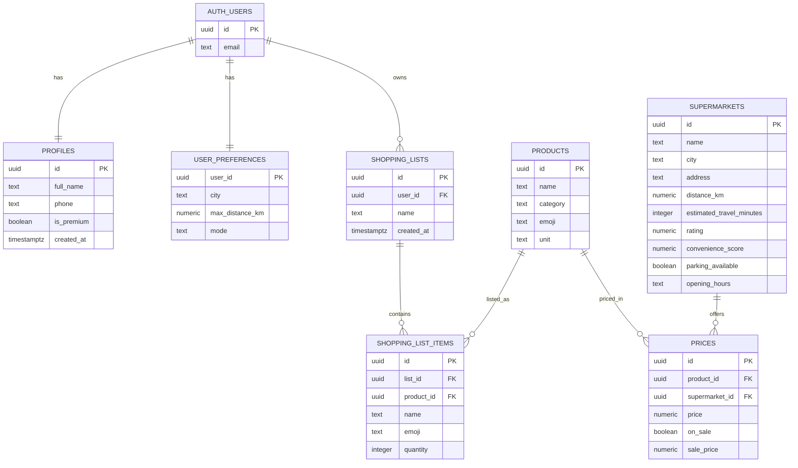

# 🛒 SMARTCART

> אפליקציית קניות בעברית (RTL) שמרכיבה עבורך את **סל הקניות הזול ביותר** — לפי רשימת הקניות, המיקום, המרחק, המבצעים וההעדפות שלך.

🔗 **אתר חי (Vercel):** <https://smartcart-ruby-gamma.vercel.app/>

💻 **קוד מקור (GitHub):** <https://github.com/yoad336/smartcart>

---

## 🔎 סקירה כללית

SMARTCART מאפשרת למשתמש לבנות רשימת קניות, לבחור אזור והעדפות, והאפליקציה משווה את המחירים בין רשתות הסופרמרקט וממליצה **היכן הכי משתלם לקנות** — בחנות אחת, או בפיצול חכם בין כמה חנויות לחיסכון מרבי.

> ℹ️ **הערה חשובה על הנתונים:** הקטלוג שמוצג באפליקציה (רשתות, מוצרים ומחירים) הוא **נתוני דמו לצורך הדגמה בלבד**, ולא מחירים אמיתיים בזמן אמת. הצגת מחירים אמיתיים מחייבת הורדה ועיבוד שוטף של מסדי נתונים גדולים וכבדים מאוד (קובצי שקיפות המחירים שכל רשת מפרסמת), דבר שחורג מהיקף פרויקט הגמר. **לוגיקת האופטימיזציה וכל הזרימה המרכזית עובדות במלואן על נתוני הדמו** — בדיוק כפי שיעבדו על נתונים אמיתיים אם יוזנו למערכת. כך אפשר לבדוק את המוצר מקצה לקצה ללא תלות במאגר חיצוני.

## 🎯 הבעיה שהפרויקט פותר

מחירי המצרכים משתנים מאוד בין רשתות וסניפים, והשוואה ידנית של סל שלם — מוצר מול מוצר, חנות מול חנות — היא מייגעת וכמעט בלתי אפשרית. כתוצאה מכך רוב האנשים קונים בחנות אחת מתוך נוחות, ומשלמים יותר מהנדרש. SMARTCART עושה את ההשוואה הזו אוטומטית ומראה בדיוק כמה אפשר לחסוך.

## 👥 קהל היעד

משקי בית ישראליים וקונים מודעים לתקציב שעורכים קנייה שבועית קבועה ורוצים לחסוך כסף בלי לבזבז זמן על השוואות — משפחות, סטודנטים, וזוגות צעירים. המשתמש הטיפוסי פותח את האפליקציה לפני קנייה גדולה, מזין את הרשימה, ומקבל המלצה היכן לקנות.

## 🆚 מתחרים ובידול

| החלופה הקיימת | המגבלה שלה | הבידול של SMARTCART |
|---|---|---|
| השוואה ידנית / עלונים ופלאיירים | איטית, חלקית, מתיישנת מהר | השוואה אוטומטית ומלאה לכל הסל בלחיצה |
| אפליקציות הרשתות (רמי לוי, שופרסל) | כל אחת מציגה רק את המחירים של עצמה | משווה **בין** כל הרשתות במקום אחד |
| אתרי השוואת מחירים כלליים (זאפ וכו׳) | ממוקדים באלקטרוניקה/מוצר בודד, לא בסל מצרכים | בונה **סל מלא** מותאם למיקום ולהעדפות |
| ניהול רשימה ב־WhatsApp / Excel / נייר | מנהל רשימה אבל לא מחשב מחיר או חיסכון | מחבר רשימה + מחירים + מיקום להמלצת חיסכון |

**הבידול המרכזי:** SMARTCART לא רק מנהלת רשימה — היא **מרכיבה סל אופטימלי** לפי הרשימה האמיתית שלך, המרחק והמבצעים, כולל אופציית פיצול בין חנויות לחיסכון מרבי. הכול בעברית ובמובייל.

## 💡 הערך המוסף והבידול של SMARTCART

SMARTCART היא מערכת לקבלת החלטת קנייה, ולא עוד כלי להשוואת מחירים. ההבדל אינו בכמות הנתונים שהיא אוספת, אלא במה שהיא עושה איתם עבור המשתמש.

אפליקציות כמו Pricez, CHP ו-Zap Market עושות עבודה טובה באיסוף מחירים. הן משוות מוצרים בין רשתות, בונות סל ומציגות היכן הוא זול יותר, ולעיתים אף מציעות את הסניף הזול ביותר לרשימה כולה. אחרי שהמשתמש מקבל את המספרים הוא עדיין נשאר עם השאלה המעשית: האם המחיר הנמוך ביותר משתלם לי אם הוא נמצא במרחק נסיעה גדול, או דורש לפצל את הקנייה בין כמה חנויות? את השיקול הזה הכלים הקיימים משאירים למשתמש.

כאן נכנס הערך המוסף של SMARTCART. המערכת מוסיפה שכבת אופטימיזציה שמביאה בחשבון לא רק את מחיר הסל, אלא גם את המרחק, זמן הנסיעה, הנוחות, ההעדפות האישיות והאפשרות לפצל את הקנייה בין כמה סופרים. במקום לעצור בהצגת המחיר הזול ביותר, היא מתרגמת את הגורמים האלה להמלצה אחת ברורה.

**חנות אחת או פיצול.** SMARTCART בוחנת עבור המשתמש האם עדיף לקנות את כל הסל במקום אחד או לפצל אותו בין כמה רשתות, ומציגה את ההפרש בשקלים בין שתי האפשרויות. ההחלטה אם "שווה לי לעבור עוד חנות" מתבססת על החיסכון בפועל ולא על תחושה.

**התאמה לסוג המשתמש.** אותה רשימת קניות יכולה להוביל להמלצה שונה לפי מי שמחזיק בטלפון. סטודנטית עם תקציב מוגבל תבחר לרוב בחיסכון מרבי, גם במחיר של פיצול בין שתי חנויות. אב לשלושה ילדים בסוף יום עבודה יעדיף קנייה אחת קצרה וקרובה, גם אם תעלה מעט יותר. SMARTCART מתאימה את ההמלצה להעדפה הזו במקום לתת לכולם את אותה תשובה "זולה ביותר".

**תחליפים חכמים.** כשהמשתמש אינו נעול על מותג מסוים, המערכת יכולה להציע החלפה של מוצר יקר במוצר דומה וזול יותר, ולהוזיל את הסל מבלי לפגוע ברשימה עצמה.

**הנמקה שקופה.** לכל המלצה מצורף הסבר קצר בשפה פשוטה, למשל: "הסל הזה נבחר כי הוא זול ב-32 ש״ח, נמצא במרחק סביר, ויש בו את רוב המוצרים מהרשימה". המשתמש מבין מדוע זו ההמלצה, ויכול להחליט מתוך מידע ולא מתוך אמון עיוור באלגוריתם.

המשפט שמסכם את ההבדל:

> **המתחרים מציגים מחירים — SMARTCART מקבלת החלטה עבור המשתמש.**

### טבלת השוואה: SMARTCART מול המתחרים

| מתחרה | מה הוא עושה טוב | מה חסר בו | מה SMARTCART מוסיפה |
|---|---|---|---|
| **Pricez (פרייסז)** | שירות חברתי לניהול ושיתוף רשימות, מציאת "הסל הזול" לכלל הרשימה באזור, התראות על ירידות מחיר והצעת מוצרים חליפיים | ההמלצה ממוקדת במחיר הנמוך ביותר ולרוב מפנה לסניף יחיד, בלי לשקלל מרחק, זמן ונוחות או להתאים לפרופיל המשתמש; חלק מהמחירים מתעדכנים בידי הגולשים | שקלול נוחות וזמן מול החיסכון, החלטה מפורשת בין חנות אחת לפיצול לפי החיסכון בפועל, והנמקה מותאמת לסוג המשתמש |
| **CHP** | השוואה מבוססת נתוני שקיפות מחירים רשמיים בין סניפי הרשתות ברדיוס עד 10 ק״מ, מיון מהזול ליקר, בניית סל והשוואת עלות כוללת (כולל פיצול), והצגת מבצעים, חינם וללא הרשמה | מציג את הנתונים ומשאיר את ההחלטה למשתמש; אינו משקלל מרחק, זמן ונוחות כעלות, אינו מתאים לפרופיל ואינו מנמק את הבחירה | הופך את אותם נתונים להחלטה: בחירה בין חנות אחת לפיצול לפי החיסכון, שקלול מרחק ונוחות, והסבר ברור להמלצה |
| **Zap Market (זאפ מרקט)** | מותג השוואה ותיק (קבוצת זאפ), השוואת מחירי מוצר בין רשתות מזון בסריקת ברקוד, והרכבת סל והשוואה לפי מיקום בזמן אמת | מנוע ממוקד מוצר ומחיר שמשאיר את הבחירה למשתמש; אינו משקלל זמן ונוחות, אינו מתאים לפרופיל ואינו מספק החלטה מוסברת | שכבת החלטה שמשקללת מחיר, מרחק ונוחות, בוחרת חנות אחת מול פיצול ומספקת המלצה מוסברת ומותאמת אישית |

### לסיכום

הבידול המרכזי של SMARTCART הוא המעבר מהצגת מידע לקבלת החלטה. הכלים הקיימים נותנים למשתמש מחירים, השוואות וסלים זולים, ומשאירים לו לשקול בעצמו מחיר מול מרחק, זמן ונוחות. SMARTCART עושה את השקלול הזה עבורו, בוחרת בין קנייה אחת לפיצול לפי החיסכון בפועל, מתאימה את ההמלצה לסוג המשתמש, ומסבירה את הבחירה בשפה פשוטה. כך הופכת השוואת המחירים מנתון גולמי לכלי החלטה חכם, אישי ומעשי. חלק מהיכולות המתקדמות, כמו שקלול זמן ונוחות, התאמה אוטומטית לפרופיל והצעת תחליפים, מהוות את כיוון הפיתוח של המוצר (וחלקן מרוכזות בתוכנית הפרימיום), בעוד שגרסת ה-MVP הנוכחית כוללת כבר את הליבה: השוואת מחירים, סינון לפי מרחק, בחירה בין חנות אחת לפיצול וחישוב החיסכון.

## ✨ תכונות עיקריות

- בניית רשימת קניות עם חיפוש, קטגוריות ועדכון כמויות.
- השוואת מחירים בין רשתות, ממוינת מהזול ליקר, עם סימון מבצעים.
- **מנוע אופטימיזציה**: חישוב עלות דלק משוערת, זמן נסיעה ונוחות, וציון כדאיות כולל (0–100) לכל סופר.
- **המלצה מנומקת** — "הסל המשתלם ביותר בפועל", עם אזור "למה זו ההמלצה?" שמסביר את הבחירה בשפה פשוטה.
- **החלטת פיצול**: בדיקה אוטומטית האם משתלם לפצל את הקנייה בין כמה חנויות או לקנות באחת, לפי החיסכון בפועל מול תוספת הזמן והדלק.
- **מצבי אופטימיזציה**: חיסכון מקסימלי · מאוזן · מינימום זמן · נוחות (סופר אחד).
- **תחליפים חכמים**: הצעה להחליף מוצר יקר בחלופה דומה וזולה יותר.
- **השוואת חלופות**: 2–3 סופרים נוספים עם מחיר, מרחק, זמן, דלק וציון כדאיות.
- שמירת רשימות, אזור והעדפות (עיר, רדיוס, דלק, פיצול, מצב אופטימיזציה).
- התחברות והרשמה עם Supabase Auth.

## 🖼️ צילומי מסך

| דף הבית | רשימת קניות | הסל החכם |


## 📁 מבנה הפרויקט

הפרויקט מאורגן כמבנה שטוח (Flat) של עשרה קבצים — נוח לקריאה, להגשה ולסקירה. כל שכבת ה־React מרוכזת בקובץ אחד, והלוגיקה הטהורה והנתונים מופרדים לקבצים ייעודיים.

| קובץ | תפקיד |
|---|---|
| `index.html` | נקודת הכניסה של Vite. RTL + טעינת הפונט Assistant. האייקון (favicon) מוטמע inline. |
| `main.jsx` | אתחול React. עוטף את האפליקציה ב־`BrowserRouter`, `AuthProvider` ו־`CartProvider`. |
| `App.jsx` | **כל שכבת ה־React**: אייקונים (SVG), שני ה־Contexts (Auth + Cart), רכיבי UI משותפים (Header, BottomNav, PrivateRoute), כל 9 המסכים, והנתב (Router). |
| `support.js` | **לוגיקה טהורה + שכבת נתונים**: מנוע השוואת המחירים והעגלה, **מנוע האופטימיזציה** (עלות דלק, זמן, ציון כדאיות, ניתוח פיצול ותחליפים — פונקציות נטו, ללא React), ושירות הנתונים שמדבר עם Supabase — עם נפילה אוטומטית לנתוני דמו. |
| `supabaseClient.js` | יצירת ה־Supabase client ממשתני הסביבה, עם בדיקת תקינות (`isSupabaseConfigured`). |
| `data.js` | קטלוג דמו (5 רשתות, 19 מוצרים, מחירים ותחליפים) — מאפשר ריצה מלאה ללא שרת. |
| `index.css` | מערכת העיצוב (Design System): משתני CSS, טיפוגרפיה, רכיבים — ללא תלות build. |
| `vite.config.js` | קונפיגורציית Vite (פלאגין React, פורט). |
| `package.json` | תלויות וסקריפטים (`dev` / `build` / `preview`). |
| `README.md` | הקובץ הזה. |

> 💡 **למה מבנה שטוח?** כל המסכים, הרכיבים וה־Contexts מאוחדים ל־`App.jsx` כדי שאפשר יהיה לקרוא את כל ממשק המשתמש במקום אחד, בלי לקפוץ בין תיקיות — בעוד הלוגיקה (`support.js`), הנתונים (`data.js`) וחיבור ה־Supabase (`supabaseClient.js`) נשארים מודולים נפרדים וברורים.

## 🗄️ מודל הנתונים — ERD (Supabase)

הדיאגרמה מתארת את הסכימה המלאה: 7 טבלאות + `auth.users` המנוהל ע״י Supabase. בגרסה החיה, טבלאות הקטלוג (`supermarkets`, `products`, `prices`) מאוכלסות ב**נתוני דמו** — ראו ההערה על הנתונים בראש המסמך.



## 🔌 שירותים חיצוניים ואינטגרציות

| שירות | סוג | למה משמש במוצר |
|---|---|---|
| Supabase Auth | אוטנטיקציה | הרשמה והתחברות משתמשים (email + password) |
| Supabase PostgreSQL | בסיס נתונים | שמירת פרופילים, רשימות, מוצרים, מחירים והעדפות — עם Row-Level Security |
| Vercel | אירוח (Hosting) | פריסת ה־Frontend (React) לאוויר |
| Google Fonts | נכס עיצוב | טעינת הפונט Assistant |

> כל מפתחות ה־API מוזרקים כמשתני סביבה (`VITE_SUPABASE_URL`, `VITE_SUPABASE_ANON_KEY`) ואינם נשמרים בקוד.

## 🧱 סטאק טכנולוגי

React + Vite · React Router · Supabase (Auth · PostgreSQL) · CSS Variables (Design System) · Vercel.

## 🚀 הרצה מקומית

```bash
npm install
npm run dev
```

ללא הגדרת Supabase האפליקציה רצה אוטומטית **במצב דמו** עם קטלוג לדוגמה — כל הזרימה המרכזית (רשימה ← העדפות ← השוואה ← סל חכם) עובדת מקצה לקצה גם בלי שרת. לחיבור מלא, ראו "משתני סביבה".

## 🔑 משתני סביבה (חיבור Supabase – אופציונלי)

כדי לחבר חשבון אמיתי (התחברות, הרשמה ושמירת רשימות), צרו בתיקיית השורש קובץ בשם `.env` עם הערכים שלכם:

```bash
# Supabase Dashboard → Project Settings → API
VITE_SUPABASE_URL=https://YOUR-PROJECT-ref.supabase.co
VITE_SUPABASE_ANON_KEY=YOUR-ANON-PUBLIC-KEY
```

ב־Vite רק משתנים עם הקידומת `VITE_` נחשפים ללקוח. אם הקובץ חסר, האפליקציה תזהה זאת ותעבור אוטומטית למצב דמו עם הודעה ברורה.

> מבנה הטבלאות הדרוש בצד ה־Supabase מתואר בדיאגרמת ה־ERD למעלה (7 טבלאות + RLS).

## ☁️ פריסה (Vercel)

1. ייבאו את הריפו ל־Vercel (Framework מזוהה אוטומטית: **Vite**).
2. הגדירו ב־Vercel את משתני הסביבה `VITE_SUPABASE_URL` ו־`VITE_SUPABASE_ANON_KEY` (אופציונלי — בלעדיהם האתר ירוץ במצב דמו).
3. לאחר הפריסה, ב־Supabase → Authentication → URL Configuration הוסיפו את כתובת ה־Vercel ל־Site URL ול־Redirect URLs.

## 🧪 בדיקה ונתוני דמו

- האפליקציה כוללת קטלוג דמה (5 רשתות, 19 מוצרים, מחירים) — הזרימה המרכזית עובדת מקצה לקצה גם בלי להזין נתונים.
- כדי לבדוק התחברות (כשמוגדר Supabase): נרשמים עם אימייל וסיסמה כלשהם (לפחות 6 תווים).
- 💡 לבדיקה חלקה, ב־Supabase → Authentication → Providers כבו את "Confirm email", כך שאפשר להתחבר מיד אחרי הרשמה בלי אימות מייל.

---

נבנה כפרויקט גמר · בניית אפליקציה Full-Stack מונחית AI.
